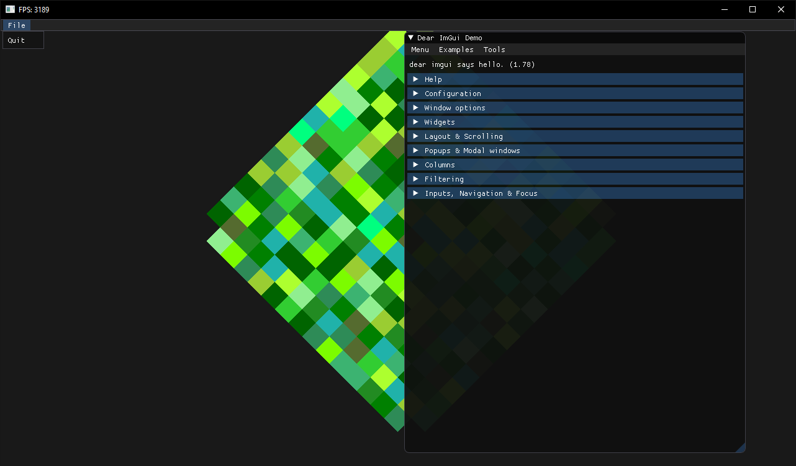

# FNA-Bootstrap-With-ImGUI
Quickly bootstrap FNA based projects. Also comes with ImGUI.NET

# Prerequisites

.net5 needs to be installed. You can grab it from [here](https://dotnet.microsoft.com/download)

# Get the Code

```bash
git clone --recursive https://github.com/deccer/FNA-Bootstrap-With-ImGUI YourProjectName
cd YourProjectName
git submodule update --init --recursive
```

And then start at `Client.cs`

# Third party dependencies

- `Serilog` for logging
- `Microsoft.Extensions.DependencyInjection` DI container
- `StyleCop` static code analysis
- `CSharpFunctionalExtensions` for `Result<T>`
- `ImGUI.NET` the user interface


